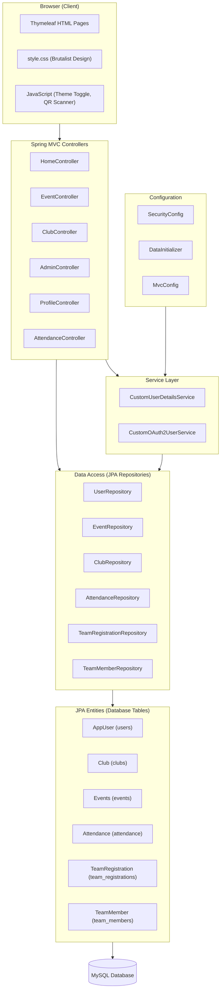
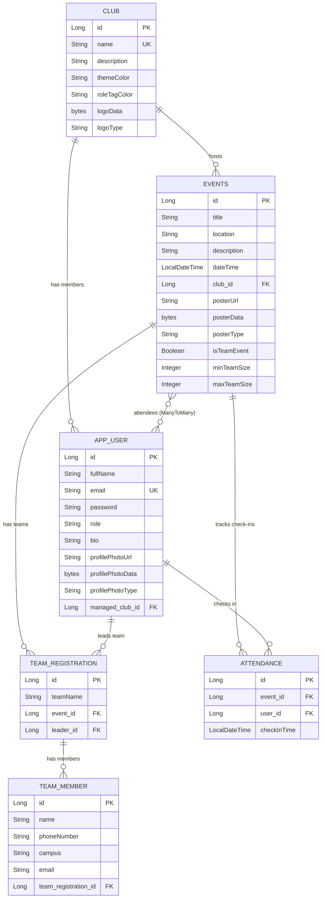
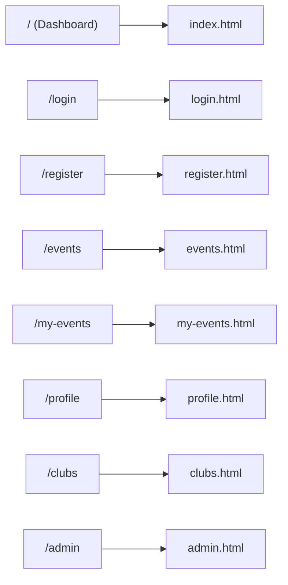

# CampusCrew - Comprehensive Project Report

> A full-stack campus club and event management platform built with Spring Boot 4, Thymeleaf, Spring Security, OAuth2, MySQL, and Bootstrap 5.

---

## Table of Contents
1. [Project Overview](#1-project-overview)
2. [Technology Stack](#2-technology-stack)
3. [Architecture Diagram](#3-architecture-diagram)
4. [Entity Relationship Diagram](#4-entity-relationship-diagram)
5. [Role Hierarchy & Access Control](#5-role-hierarchy--access-control)
6. [File-by-File Breakdown](#6-file-by-file-breakdown)
7. [Development Timeline](#7-development-timeline)
8. [Security Measures](#8-security-measures)
9. [Frontend Design System](#9-frontend-design-system)
10. [Future Enhancements](#10-future-enhancements)

---

## 1. Project Overview

**CampusCrew** is a web application that allows university administrators and club leaders to manage student organizations, publish events, handle solo and team-based registrations, and track attendance via QR codes. Students can browse events, register, view their tickets, and check in at the door.

### Core Capabilities

| Feature | Description |
|---|---|
| **Dual Authentication** | Form-based login + Google OAuth2 |
| **Role-Based Access** | 5-tier hierarchy from Student to Super Admin |
| **Club Management** | Create, edit, delete clubs with logos and brand colors |
| **Event Orchestration** | Solo and team events with poster uploads |
| **QR Attendance** | Generate QR passes, scan at door, export CSV |
| **Member Roster** | Presidents manage their club members' ranks |
| **Dark Mode** | Persistent theme toggle via localStorage |
| **Brutalist UI** | Custom CSS design system with Bento grid layout |

---

## 2. Technology Stack

| Layer | Technology | Purpose |
|---|---|---|
| **Runtime** | Java 21 | Core language |
| **Framework** | Spring Boot 4.0.2 | Application framework |
| **Security** | Spring Security + OAuth2 Client | Auth and RBAC |
| **ORM** | Spring Data JPA (Hibernate) | Database abstraction |
| **Database** | MySQL | Persistent storage |
| **Templating** | Thymeleaf + Spring Security dialect | Server-side HTML |
| **Frontend** | Bootstrap 5.3 + Custom CSS | UI framework |
| **QR Scanner** | html5-qrcode (JS library) | Camera-based scanning |
| **Build Tool** | Maven | Dependency management |

### Key Dependencies from `pom.xml`
- `spring-boot-starter-data-jpa` -- JPA/Hibernate ORM
- `spring-boot-starter-security` -- Authentication framework
- `spring-boot-starter-security-oauth2-client` -- Google login
- `spring-boot-starter-thymeleaf` -- Template engine
- `spring-boot-starter-webmvc` -- MVC web layer
- `thymeleaf-extras-springsecurity6` -- `sec:authorize` in templates
- `mysql-connector-j` -- MySQL JDBC driver

---

## 3. Architecture Diagram



---

## 4. Entity Relationship Diagram



---

## 5. Role Hierarchy & Access Control

### The 5-Tier Role System

| Role | Power Level | Capabilities |
|---|---|---|
| `ROLE_USER` | 1 | Browse events, register, view tickets |
| `ROLE_MEMBER` | 2 | Above + view guest lists, QR check-in, scan tickets |
| `ROLE_CORE_MEMBER` | 3 | Above + export attendance CSV |
| `ROLE_PRESIDENT` | 4 | Above + create/edit/delete events for own club, manage roster |
| `ROLE_SUPER_ADMIN` | 5 | Unrestricted access to everything |

### SecurityConfig Access Rules

```
/register, /login, /css/**, /uploads/**  --> PUBLIC (permitAll)
/admin/**                                --> SUPER_ADMIN only
/events/*/attendance/export              --> SUPER_ADMIN, PRESIDENT, CORE_MEMBER
/events/scan-ticket                      --> All club roles + MEMBER
POST /events/*/register, /cancel         --> Any authenticated user
POST /events/**                          --> SUPER_ADMIN, PRESIDENT
POST /clubs/create                       --> SUPER_ADMIN only
/clubs/**                                --> SUPER_ADMIN, PRESIDENT
Everything else                          --> Authenticated
```

### Supreme Admin Protection
The `DataInitializer` creates a root admin on first boot. The `AdminController` has special logic:
- The Supreme Admin email (`admin316@campuscrew.com`) **cannot be modified or deleted** by anyone
- Other Super Admins can only be modified/deleted by the Supreme Admin
- Presidents cannot promote anyone to Super Admin

---

## 6. File-by-File Breakdown

---

### 6.1 Entry Point: `CampuscrewApplication.java`

```java
@SpringBootApplication
public class CampuscrewApplication {
    public static void main(String[] args) {
        SpringApplication.run(CampuscrewApplication.class, args);
    }
}
```

**Line-by-line:**
- `@SpringBootApplication` -- Combines `@Configuration`, `@EnableAutoConfiguration`, and `@ComponentScan`. Tells Spring to scan the `com.campuscrew.backend` package for beans.
- `SpringApplication.run(...)` -- Bootstraps the embedded Tomcat server, initializes the Spring context, runs all `CommandLineRunner` beans (like `DataInitializer`).

---

### 6.2 Configuration Layer

#### `DataInitializer.java` -- First-Boot Admin Seeding

| Line | What It Does |
|---|---|
| `@Value("${app.admin.email:admin316@campuscrew.com}")` | Reads admin email from environment variables; falls back to default |
| `@Value("${app.admin.password:admin@316}")` | Reads admin password from env vars; falls back to default |
| `CommandLineRunner` bean | Runs once at startup |
| `userRepository.findByEmail(adminEmail) == null` | Checks if Master Admin already exists |
| `passwordEncoder.encode(adminPassword)` | **BCrypt hashes** the password before saving |
| `admin.setRole("ROLE_SUPER_ADMIN")` | Grants the highest privilege tier |

> [!IMPORTANT]
> The `@Value` annotations with defaults mean credentials can be injected via environment variables in production, but the app still works locally with defaults. This is the security parameterization we implemented.

#### `SecurityConfig.java` -- The Firewall

**`passwordEncoder()` bean** -- Returns a `BCryptPasswordEncoder`. All passwords are hashed with bcrypt (cost factor 10 by default). Plaintext passwords never touch the database.

**`filterChain()` bean** -- Defines the entire security policy:
- **Lines 31-39**: URL-to-role mapping (see table in Section 5)
- **Lines 41-44**: Form login config -- custom `/login` page, redirect to `/` on success
- **Lines 46-52**: OAuth2 login config -- same login page, delegates to `CustomOAuth2UserService`
- **Lines 53-57**: Logout config -- POST to `/logout`, redirect to `/login?logout`

#### `MvcConfig.java` -- Static File Serving

```java
registry.addResourceHandler("/uploads/**")
        .addResourceLocations("file:uploads/");
```
Maps the URL path `/uploads/**` to the physical `uploads/` directory on disk. This serves uploaded profile photos stored on the filesystem.

---

### 6.3 Entity Layer (Database Models)

#### `AppUser.java` -- The User Table

| Field | Annotation | Purpose |
|---|---|---|
| `id` | `@Id @GeneratedValue(IDENTITY)` | Auto-increment primary key |
| `email` | `@Column(unique, nullable=false)` | Login identifier, must be unique |
| `password` | plain field | BCrypt hash (null for OAuth users) |
| `role` | plain field | One of the 5 role strings |
| `managedClub` | `@ManyToOne @JoinColumn("managed_club_id")` | Which club this user belongs to |
| `profilePhotoData` | `@Lob @Column("LONGBLOB")` | Binary image data stored in DB |
| `profilePhotoType` | plain field | MIME type (e.g., "image/jpeg") |
| `events` | `@ManyToMany(mappedBy="attendees")` | Inverse side of event registration |

#### `Club.java` -- The Club Table

| Field | Purpose |
|---|---|
| `name` | Unique club name |
| `themeColor` | Hex color code for branding (e.g., `#3366FF`) |
| `roleTagColor` | Hex color for member role badges |
| `logoData` / `logoType` | Binary logo image stored as LONGBLOB |
| `events` | `@OneToMany(cascade=ALL, EAGER)` -- Deleting a club cascades to all its events |
| `members` | `@OneToMany(mappedBy="managedClub", EAGER)` -- All users assigned to this club |

#### `Events.java` -- The Events Table

| Field | Purpose |
|---|---|
| `attendees` | `@ManyToMany` -- The join table connecting users to events |
| `club` | `@ManyToOne` -- Which club hosts this event |
| `posterData` / `posterType` | Binary poster image (LONGBLOB) |
| `isTeamEvent` | Boolean flag toggling solo vs team mode |
| `minTeamSize` / `maxTeamSize` | Constraints for team registration |
| `teamRegistrations` | `@OneToMany(cascade=ALL, orphanRemoval=true)` -- All teams registered |

#### `TeamRegistration.java` -- Team Groups

Links an event to a team leader (`AppUser`) and contains a list of `TeamMember` children. The `addMember()` method sets the bidirectional relationship:
```java
public void addMember(TeamMember member) {
    members.add(member);
    member.setTeamRegistration(this);  // Sets the back-reference
}
```

#### `TeamMember.java` -- Individual Team Members
Stores name, phone, campus, and email for each non-registered teammate. These are **not** `AppUser` entities -- they're freeform entries for external participants.

#### `Attendance.java` -- Check-in Records
Links a `user` + `event` + `checkInTime`. The `checkInTime` is set to `LocalDateTime.now()` at the moment of QR scan.

---

### 6.4 Repository Layer (Data Access)

All repositories extend `JpaRepository<Entity, Long>`, which provides `findAll()`, `findById()`, `save()`, `delete()` out of the box.

| Repository | Custom Methods |
|---|---|
| `UserRepository` | `findByEmail(String)` -- login lookup; `findByFullNameContainingIgnoreCaseOrEmailContainingIgnoreCase(String, String)` -- admin search |
| `EventRepository` | `findByTitleContainingIgnoreCase(String)` -- event search; `findByAttendeesContaining(AppUser)` -- "My Events"; `findTop4ByOrderByDateTimeAsc()` -- dashboard preview |
| `ClubRepository` | `findByName(String)` -- lookup by name |
| `AttendanceRepository` | `findByEvent(Events)` -- all check-ins for export; `existsByEventIdAndUserId(Long, Long)` -- prevent double check-in |
| `TeamRegistrationRepository` | `findByEventAndLeader(Events, AppUser)` -- find a user's team for cancellation |
| `TeamMemberRepository` | (no custom methods -- uses JPA defaults) |

> [!TIP]
> Spring Data JPA generates SQL from method names automatically. For example, `findByTitleContainingIgnoreCase("hack")` becomes `SELECT * FROM events WHERE LOWER(title) LIKE '%hack%'`.

---

### 6.5 Service Layer (Authentication)

#### `CustomUserDetailsService.java` -- Form Login

```java
public UserDetails loadUserByUsername(String email) {
    AppUser user = userRepository.findByEmail(email);
    if (user == null) throw new UsernameNotFoundException("User not found");
    return User.builder()
        .username(user.getEmail())
        .password(user.getPassword())
        .authorities(user.getRole() != null ? user.getRole() : "ROLE_USER")
        .build();
}
```
Spring Security calls this when a user submits the login form. It:
1. Looks up the user by email
2. Wraps their credentials into a Spring `UserDetails` object
3. Spring compares the submitted password against the BCrypt hash

#### `CustomOAuth2UserService.java` -- Google Login

```java
public OAuth2User loadUser(OAuth2UserRequest userRequest) {
    OAuth2User oAuth2User = super.loadUser(userRequest);
    String email = oAuth2User.getAttribute("email");
    AppUser user = userRepository.findByEmail(email);
    if (user == null) {
        user = new AppUser();
        user.setEmail(email);
        user.setFullName(oAuth2User.getAttribute("name"));
        user.setProfilePhotoUrl(oAuth2User.getAttribute("picture"));
        user.setRole("ROLE_USER");
        userRepository.save(user);
    }
    List<GrantedAuthority> authorities = List.of(new SimpleGrantedAuthority(user.getRole()));
    return new DefaultOAuth2User(authorities, oAuth2User.getAttributes(), "email");
}
```
This runs after Google returns the user's profile. It:
1. Checks if the email already exists in the DB
2. If new: creates an account with their Google name/photo, assigns `ROLE_USER`
3. If existing: uses their current role (so an admin who logs in via Google keeps admin powers)
4. Returns an authenticated user with the correct authority

---

### 6.6 Controller Layer (Business Logic)

#### `HomeController.java`

| Endpoint | Method | What It Does |
|---|---|---|
| `GET /` | `home()` | Loads top 4 upcoming events for the bento dashboard, identifies current user |
| `GET /login` | `showLoginPage()` | Returns the login template |
| `GET /register` | `showRegisterPage()` | Returns the registration template |
| `POST /register` | `registerUser()` | Creates new `AppUser`, BCrypt-encodes password, saves to DB, redirects to login |

#### `EventController.java`

| Endpoint | Method | Key Logic |
|---|---|---|
| `GET /events` | `listEvents()` | Loads all events (or filtered by keyword). Also loads all clubs for the "Post Event" dropdown |
| `GET /events/{id}/poster` | `getEventPoster()` | Serves poster BLOB as an HTTP response with correct MIME type |
| `POST /events` | `createEvent()` | **Role check**: Super Admin can pick any club; Presidents are forced to their own club. Validates poster MIME type. Saves event |
| `POST /events/{id}/register` | `registerForEvent()` | Adds user to `event.attendees` if not already registered |
| `POST /events/{id}/register-team` | `registerTeamForEvent()` | Creates `TeamRegistration` + `TeamMember` children from parallel form arrays |
| `POST /events/{id}/cancel` | `cancelRegistration()` | Removes user from attendees, deletes their `TeamRegistration` if it exists |
| `POST /events/{id}/edit` | `editEvent()` | **Ownership check**: Only the club's president or Super Admin can edit |
| `POST /events/{id}/delete` | `deleteEvent()` | **Ownership check**: Same as edit |
| `GET /my-events` | `myEvents()` | Fetches only events where user is in the attendees list |

> [!IMPORTANT]
> **The Club Ownership Guard** (lines 90-96 of `createEvent`): If a President tries to create an event, `assignedClubId` is forcefully overridden to their own club's ID, regardless of what they submitted. This prevents Presidents from creating events for other clubs.

#### `ClubController.java`

| Endpoint | Key Logic |
|---|---|
| `GET /clubs` | Loads all clubs + current user for ownership checks |
| `POST /clubs/create` | Super Admin only. Validates logo MIME type, saves club with brand colors |
| `GET /clubs/{id}/logo` | Serves club logo BLOB with correct content type |
| `POST /clubs/edit/{id}` | Ownership check: only the club's president or Super Admin |
| `POST /clubs/{id}/delete` | Super Admin only |
| `POST /clubs/{clubId}/update-role` | **Role promotion logic**: Presidents can promote up to Core Member. Only Super Admin can promote to President. Super Admins are immune |

#### `AdminController.java`

| Endpoint | Key Logic |
|---|---|
| `GET /admin` | Loads all users (with optional search). Populates club dropdown |
| `POST /admin/update-role` | **Triple protection**: (1) Supreme Admin is immutable, (2) Other Super Admins can only be modified by Supreme Admin, (3) Presidents cannot create Super Admins |
| `POST /admin/users/{id}/delete` | Same protections. Also cleans up the user's event registrations before deletion |

#### `ProfileController.java`

| Endpoint | Key Logic |
|---|---|
| `GET /profile` | Loads current user's data for display |
| `POST /profile/edit` | Updates name, bio, profile photo. MIME-type validated |
| `GET /users/{id}/avatar` | Serves profile photo BLOB |

#### `AttendanceController.java`

| Endpoint | Key Logic |
|---|---|
| `GET /events/{id}/checkin` | **QR link target**. Checks if user already checked in (`existsByEventIdAndUserId`). Creates `Attendance` record with timestamp |
| `GET /events/{id}/attendance/export` | Generates CSV file with columns: Full Name, Email, Role, Check-In Time |
| `POST /events/scan-ticket` | **Staff scanner**. Parses QR data format `user:{email},event:{id}`. Validates: (1) user exists, (2) event exists, (3) user is registered, (4) not already checked in |

---

### 6.7 Frontend Templates

#### Request Flow Diagram



| Template | Lines | Key Features |
|---|---|---|
| `index.html` | 211 | Bento grid dashboard, hero marquee, top 4 events with posters, poster magnify modals, President roster modal, dark mode toggle |
| `login.html` | 60 | Form login + Google OAuth button, error/logout alerts |
| `register.html` | 71 | Registration form + Google OAuth button |
| `events.html` | 580 | Event cards with posters, search bar, "Post Event" sidebar, team registration modal, edit modal, QR modal, guest list modal, global QR scanner modal, JS for team form validation |
| `my-events.html` | 150 | Registered event cards with club-colored top borders, QR pass modal for each event |
| `profile.html` | 145 | Identity card with role badges, edit form with photo upload |
| `clubs.html` | 283 | Club directory table, create club form (Admin only), edit club modal, roster modal per club |
| `admin.html` | 164 | User management table with search, role/club assignment dropdowns, Supreme Admin protection badges |

---

## 7. Development Timeline

| Date | Commit | What Changed |
|---|---|---|
| Initial | `8e38b12` | User auth (login/register) + Event CRUD |
| Early | `55a1182` | Events fully functional |
| Early | `dbc26b5` | Registration page working |
| Mar 9 | `aa60c0c` | **Google OAuth2 integration** -- users can now login with Google |
| Mar 9 | `81f55f1` | Bug fixes in admin panel |
| Mar 26 | `1f04148` | Hid `application.properties` from version control |
| Apr 1 | `bfdf059` | Code cleanup |
| **Apr 8** | `461061d` | **Major UI Overhaul** -- Created `style.css` (300+ lines), centralized brutalist design system, standardized all templates |
| **Apr 14** | `6692586` | **Architectural Changes** -- Added club logos as BLOBs, team event logic, merged edit-profile into profile, role tag colors |
| **Apr 19** | `5f85036` | **QR Code Attendance System** -- QR generation, camera scanning, CSV export, check-in endpoint |
| **Apr 21** | `fe80dd3` | **Security Enhancement** -- Environment variable parameterization, MIME-type validation, file upload hardening |

---

## 8. Security Measures

| Measure | Implementation |
|---|---|
| **Password Hashing** | BCrypt via `BCryptPasswordEncoder` |
| **CSRF Protection** | Enabled by default (Spring Security). All POST forms include CSRF tokens via Thymeleaf `th:action` |
| **File Upload Validation** | MIME-type whitelist: only `image/jpeg`, `image/png`, `image/webp`, `image/gif` |
| **Credential Parameterization** | Admin email/password read from `@Value` environment variables |
| **Role-Based URL Protection** | `SecurityFilterChain` with fine-grained matchers |
| **Ownership Verification** | Controllers check `user.getManagedClub().getId()` before allowing modifications |
| **Supreme Admin Immunity** | Root admin cannot be deleted or demoted by anyone |
| **Duplicate Check-in Prevention** | `existsByEventIdAndUserId()` prevents double attendance |
| **OAuth2 Scope Isolation** | OAuth users get `ROLE_USER` by default, must be promoted manually |

---

## 9. Frontend Design System

### Brutalist CSS Philosophy (`style.css`)

The design uses a **neo-brutalist** aesthetic:
- **Zero border radius** -- All elements are sharp rectangles (`border-radius: 0 !important`)
- **Heavy borders** -- 2-3px solid borders on everything
- **Offset box shadows** -- Cards have `6px 6px 0px` shadows that shift on hover
- **Typography** -- `Syne` (800 weight) for headings, `Outfit` for body text
- **Color palette** -- Cream background (`#FFFDF9`), dark borders (`#1A1A1A`), accent colors (red, blue, yellow, green)

### Dark Mode
- CSS variables (`--bg-cream`, `--border-dark`) invert when `[data-bs-theme="dark"]` is set
- JavaScript reads/writes `localStorage.getItem('theme')` for persistence across pages
- A `<script>` tag in `<head>` applies the theme **before render** to prevent flash of wrong theme

### Bento Grid Layout
A CSS Grid system with 4 columns:
```css
.bento-grid { grid-template-columns: repeat(4, 1fr); }
.bento-item.span-2 { grid-column: span 2; }
.bento-item.span-4 { grid-column: span 4; }
```
Responsive breakpoints collapse to 2 columns on tablet and 1 column on mobile.

---

## 10. Future Enhancements

| Enhancement | Difficulty | Impact |
|---|---|---|
| **Email Notifications** (JavaMailSender for registration confirmations) | Medium | High |
| **Analytics Dashboard** (Chart.js for attendance trends) | Medium | High |
| **Password Reset Flow** (Token-based email reset) | Medium | Medium |
| **Event Categories/Tags** (Filter by type: hackathon, workshop, etc.) | Easy | Medium |
| **Image Caching** (Redis or `@Cacheable` for BLOB serving) | Medium | High |
| **Pagination** (For events and admin user lists) | Easy | Medium |
| **WebSocket Chat** (Real-time discussion per event) | Hard | Medium |
| **Calendar Integration** (ICS file export) | Easy | Low |
| **Rate Limiting** (Prevent brute-force login attempts) | Easy | High |
| **Audit Logging** (Track who changed what and when) | Medium | High |

---

*Report generated on April 26, 2026. Covers all 30 source files across 6 packages and 7 Thymeleaf templates.*
